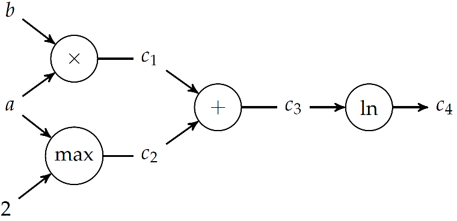
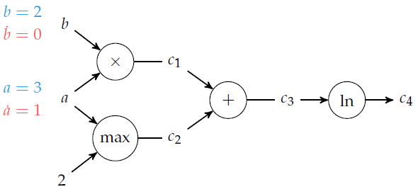
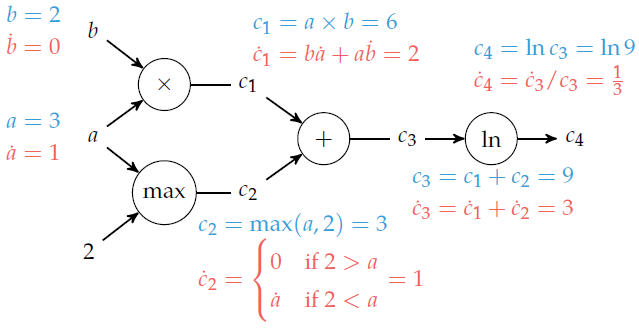

# Computación simbólica

## Expresiones simbólicas

## Iteradores

## Diferenciación automática

Las técnicas de diferenciación automática (AD) son algoritmos para evaluar numéricamente las derivadas de funciones especificadas por un programa computacional. La AD explota el hecho de que, independientemente de su complejidad, todo programa computacional ejecuta una secuencia de opraciones matemáticas elementales (suma, resta, multiplicación, división, etc.) y funciones elementales ($\exp$, $\log$, $\sin$, $\cos$, etc.). La AD aplica repetidamente la regla de la cadena para calcular, de forma automática, la derivada, de cualquier orden, de estas operaciones y funciones elementales.

La AD es diferente a la diferenciación simbólica y a la diferenciación numérica. La diferenciación simbólica consiste en transformar el programa computacional en una expresión matemática. La diferenciación numérica, como ser diferencias finitas, requiere de una discretización, que conlleva un error de truncamiento y de cancelación. Además, estos dos últimos pueden ser ineficientes cuando el número de inputs es alto, y requiere de la aplicación de algoritmos de optimización basados en el gradiente.

La AD se basa en la regla de la cadena:

$
\dfrac{d}{dx} f(g(x)) = \dfrac{d}{dx} (f \circ g) = \dfrac{df}{dg}\dfrac{dg}{dx}
$

Consideremos la función $f(a,b) = \ln(ab+\max(a, 2))$.

La derivada de $f$ respecto de $a$ resulta:

$\dfrac{\partial f}{\partial a} = \dfrac{1}{ab+\max(a, 2)}[b + (2<a)]$.

El proceso detrás de este cálculo se puede automatizar por medio de un grafo computacional. Estos grafos representan una funcion donde los nodos son operaciones y las aristas son relaciones input-output. Las hojas del grafo son las variables input y las constantes involucradas, mientras que los nodos terminales son los otuput de la función.



Existen dos métodos para derivar $f$ automáticamente usando su grafo computacional: la acumulación hacia adelante, que atraviesa el grafo en la dirección inputs$\to$outputs usando números duales, y la acumlación reversa, que requiere de una recorrida del grafo hacia atrás.

### Acumulación hacia adelante (*Forward accumulation*) 

Este método usa una única pasada del grafo computacional y es equivalente a expandir iterativamente la regla de la cadena de las operaciones internas. Cuando $f$ depende de varias variables, se debe hacer una recorrida del grafo por cada derivada parcial. Por ejemplo:

$\dfrac{df}{da} = \dfrac{df}{d c_4 } \dfrac{d c_4 }{da}=\dfrac{df}{dc_4}\left(\dfrac{dc_4}{dc_3}\dfrac{dc_3}{da}\right) = \dfrac{df}{dc_4}\left(\dfrac{dc_4}{dc_3}\left(\dfrac{dc_3}{dc_2}\dfrac{dc_2}{da}+\dfrac{dc_3}{dc_1}\dfrac{dc_1}{da}\right)\right)$

En color azul se representan las evaluaciones de las variables sucesivas, mientras en color rojo las derivadas respecto de $a$. El procedimiento es el siguiente:

1. Comenzamos desde los nodos de inputs y de valores constantes. Allí calculamos su valor y el valor de la derivada respecto de $a$. Por ejemplo, para $a=3$, $b=2$, este paso sería:



2. Luego, procedemos a recorrer el árbol, nodo por nodo, calculando el valor de la variable en el nodo y de la derivada. Para ello, debemos escoger el nodo a recorrer en cada paso de manera que ya conozcamos o hayamos calculado los inputs. Así obtenemos el siguiente grafo:




Este cálculo puede ser automatizado en una computadora si utilizamos los "números duales", que permiten calcular a la vez el valor de la función y de su derivada en cada nodo con una sola operación. Los números duales se escriben de manera similar a los complejos, $a+b \epsilon$, pero tal que $\epsilon^2=0$. Por lo tanto:

$(a+b \epsilon) + (c+d \epsilon) = (a+c)+ (b+d) \epsilon$

$(a+b \epsilon) \times (c+d \epsilon) = (ab)+ (ad+bc)\epsilon$

Si escribimos la expansión de Taylor de $f(x)$ en torno a $a$, $f(x)=\displaystyle \sum_{k=0}^{\infty}\dfrac{f^{(k)}(a)}{k!}(x-a)^k$, se obtiene que:

$f(a+b\epsilon)=f(a)+b f^{\prime}(a)\epsilon$

Por lo tanto, si pasamos un número dual a $f$, obtenemos $f$ y $f^{\prime}$ en una sola evaluación.

Con este procedimiento, para calcular el gradiente de una función que depende de $n$ variables, debemos recorrer $n$ veces el grafo. Por esto, la acumulación hacia adelante es recomendada cuando el número de outputs es mucho mayor que el número de inputs.

Implementación en Julia de la diferenciación automática de $f(a,b) = \ln(ab+\max(a, 2))$ en $a=3$, $b=2$ con el método de acumulación hacia adelante:

1- Definimos el `struct` para representar los números duales:

```julia
struct Dual
	v
	∂
end
```

y algunas operaciones básicas necesarias:

```julia
Base.:+(a::Dual, b::Dual) = Dual(a.v + b.v, a.∂ + b.∂)

Base.:*(a::Dual, b::Dual) = Dual(a.v * b.v, a.v*b.∂ + b.v*a.∂)

Base.log(a::Dual) = Dual(log(a.v), a.∂/a.v)

function Base.max(a::Dual, b::Dual)
	v = max(a.v, b.v)
	∂ = a.v > b.v ? a.∂ : a.v < b.v ? b.∂ : NaN
	return Dual(v, ∂)
end

function Base.max(a::Dual, b::Int)
	v = max(a.v, b)
	∂ = a.v > b ? a.∂ : a.v < b ? 0 : NaN
	return Dual(v, ∂)
end
```

2- Computamos el gradiente en $a=3$, $b=2$ con la implementación de acumulación hacia adelante del paquete `ForwardDiff.jl`:

```julia

f(a, b) = log(a*b + max(a,2))

using ForwardDiff

a = ForwardDiff.Dual(3,1);
b = ForwardDiff.Dual(2,0);

f(a, b) # Forward Differentitaion
```

### Acumulación reversa (*Reverse accumulation*)

La acumulación reversa requiere de una sola corrida para calcular el gradiente de $f$, independientemente de la cantidad de variables de las que depende, pero requiere de dos recorridas del grafo: una pasada hacia adelante (*forward pass*), en la que se computan todos los valores intermedios necesarios, y otra pasada hacia atrás (*backward pass*), que es la que computa el gradiente.

El procedimiento consiste en explotar la relación:

$\displaystyle \bar{c_i} = \dfrac{\partial f}{\partial c_i} = \sum_{j: \ j \mathrm{ \ es \ hijo \ de \ } i} \bar{c_j} \dfrac{\partial c_j}{\partial c_i}$,

donde $\bar{c_i}$ es el "adjunto" de $c_i$. Para derivar $f$ respecto de $a$, se sigue el grafo desde el final hasta el principio, aplicando esta relación recursiva.

En el caso de la acumulación reversa, solo se debe hacer una corrida hacia adelante (en comparación con las $n$ corridas necesarias en la acumulación hacia adelante para computar un gradiente en dimensión $n$), pero se deben tener todas las en memoria la relación entre cada variable intermedia y su derivada respecto de los nodos "hijos" en el grafo, que fueron calculadas en el paso hacia adelante. Si el grafo es grande (número de inputs mucho mayor que de outputs), el requerimiento de memoria puede ser excesivo.

Implementación en Julia de la diferenciación automática de $f(a,b) = \ln(ab+\max(a, 2))$ en $a=3$, $b=2$ con el método de acumulación reversa implementado en `Zygote.jl`:

```julia
using Zygote: gradient

gradient(f, 3.0, 2.0) # Reverse Accumulation
```

### Ejemplo: $f(x_1,x_2)=x_1 x_2 + \sin x_1$

1- Acumulación hacia adelante


Ejemplo de cálculo de $\dfrac{\partial f}{\partial x_1}$ en $(x_1, x_2)=(\pi/2,1)$.

```julia
Base.sin(a::Dual) = Dual(sin(a.v), a.∂*cos(a.v))

f(x1, x2) = x1*x2 + sin(x1)

using ForwardDiff

x1 = ForwardDiff.Dual(pi/2, 1);
x2 = ForwardDiff.Dual(1, 0);

f(x1, x2)
```

2- Acumulación reversa


```julia
using Zygote: gradient

gradient(f, pi/2, 1.0)
```


### Link recomendado:

["What is Automatic Differentiation?"](https://www.youtube.com/watch?v=wG_nF1awSSY)

---


## Entregable 5

!!! warning "Formato de entrega"
    El formato de entrega es análogo al utilizado en los entregables anteriores, ver [Ejercicio 1.2 Creación de un repositorio](https://mforets.github.io/computacion-cientifica-en-julia/dev/Herramientas/Entorno_de_desarrollo/#.2.-Creaci%C3%B3n-de-un-repositorio). En particular, todos los ejercicios entregados deben ser parte de un único módulo llamado `Entregable_5` que define la constante CI asi como también exporta las funciones que se piden en cada ejercicio entregado. **Importante:** Además debe incluir los archivos de proyecto (`Project.toml` y `Manifest.toml`) en su entrega. 

#### 5.1. Vector con entrada única

Construir un tipo que se llama `Vector1Ent` que representa un vector con un único elemento no nulo en dimension $n$. `Vector1Ent` debe admitir el siguiente constructor: `Vector1Ent(6, i=2, n=10)` donde `1` es el elemento, `i` es el indice y `n` la dimension. Es decir en este caso representamos `[0, 6, 0, 0, 0, 0, 0, 0, 0, 0]`.

Se debe implementar la interfaz de `AbstractVector{N}` prestando particular atencion a la eficiencia. Se deben tambien implementar metodos para realizar operaciones algebraicas entre pares de `Vector1Ent` asi como tambien entre arrays densos (resp. esparsos) y `Vector1Ent`. Se debe implementar ademas las siguientes funciones: `norm`, `inner`. 
Se debe tambien imprimir `Vector1Ent` de manera compacta.
