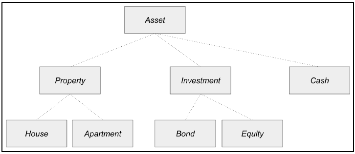

# Tipos abstractos y concretos

El *tipado* de objetos es la base de muchas caracterísiticas de `Julia`, como
ser el `multiple dispatch`. Describiremos los dos tipos posibles: abstractos y
concretos, y cómo se diferencian de otros programas orientados a objetos (OOP).


----

## Tipos abstractos

Como otros OOPs, Julia soporta jerarquía de tipos abstractos. Los tipos abstractos
se usan para modelar entidades del mundo real. Por ejemplo, `Animal` podría ser
el tipo abstracto de los tipos `gato` o `perro`, mientras que `Vehículo` puede
ser el tipo abstracto de los tipos `auto` o `camión`. Este *agrupamiento*
permite al programador aplicar código genérico que sea común a esos tipos.

Los tipos abstractos se definen in una jerarquía de tipos para cada dominio. La
relación entre tipos abstractos se puede describir como padre-hijo o, más
técnicamente, en una relación de *subtipo*.

Una característica de Julia es que, a diferencia de la mayoría de los otros
lenguajes, los tipos abstractos se definen *sin ningún campo*. Por este motivo,
los tipos abstractos no especifican cómo se almacenan los datos en memoria. Como
resultado, los tipos abstractos se usan únicamente para modelar el
comportamiento de un conjunto de objetos y no para especificar cómo se almacenan
los datos en memoria.


### Ejemplo

```@example
abstract type Asset end

abstract type Property <: Asset end
abstract type Investment <: Asset end
abstract type Cash <: Asset end

abstract type House <: Property end
abstract type Apartment <: Property end

abstract type FixedIncome <: Investment end
abstract type Equity <: Investment end
```



### Definición de funciones para tipos abstractos


----

## Tipos concretos

Los tipos concretos se utilizan en Julia para describir cómo están organizados
los datos. Los tipos concretos se clasifican en:

- Tipo primitivo
- Tipo compuesto


Primitive types carry pure bits. Julia's Base package comes with a variety of primitive
types—signed/unsigned integers that are 8-, 16-, 32-, 64-, or 128-bits wide. Currently, Julia
only supports primitive types with numbers of bits that are multiples of 8. For example, it is
possible to define a 256-bit integer type (32 bytes) if we have a use case that requires very
large integers. How to do this is outside the scope of this book. If you feel that this is an
interesting project, you can consult Julia's source code on GitHub and see how existing
primitive types are implemented. The Julia language is indeed largely written in Julia itself!


Composite types are defined by a set of named fields. Grouping fields into a single type
allows easier reasoning, sharing, and manipulation. Composite types may be designated a
specific supertype or defaulted to Any. Fields can also be annotated with their own types, if
you wish, and types can be either abstract or concrete. When type information is absent for
fields, they default to Any, which means that the field can hold objects of any type.
We will focus on composite types in this section.

### Definición de tipos concretos

Los tipos compuestos se definen con la keyword `struct`. Por ejemplo, si queremos
crear el tipo concreto `Stock` como subtipo del tipo abstracto `Equity` con dos
campos, `symbol` y `name`:

```@example
abstract type Equity end

struct Stock <: Equity
  symbol::String
  name::String
end
```

```julia
julia> stock = Stock("AAPL", "Apple, Inc.")
Stock("AAPL", "Apple, Inc.")
```

Se accede a los campos de `stock` mediante:

```julia
julia> stock.name
"Apple, Inc."

julia> stock.symbol
"AAPL"
```

### Inmutabilidad

```julia
julia> stock.name = "Apple LLC"
ERROR: setfield! immutable struct of type Stock cannot be changed
```

### Mutabilidad

En caso de querer que un objeto sea mutable, la restricción de inmutabilidad
se puede quitar fácilmente agregando la keyword `mutable` delante de la
definición del tipo. Para hacer que `Stock` sea mutable, hacemos:

```julia
mutable struct Stock <: Equity
  symbol::String
  name::String
end
```

```julia
julia> stock = Stock("AAPL", "Apple, Inc.")
Stock2("AAPL", "Apple, Inc.")

julia> stock.name = "Apple LLC"
"Apple LLC"

julia> stock
Stock2("AAPL", "Apple LLC")
```

### Ventajas y desventajas de la mutabilidad

Los objetos mutables son más flexibles y ofrecen buena performance, pero los
tipos concretos son por defecto inmutables. Esto se debe a:

- Los tipos inmutables son más fáciles de manipular. Como sus datos en el objeto
es fija, una función que opere sobre estos objetos siempre retornará resultados
consistentes.
- Para una aplicación paralelizada (*multi-threaded*) es más compliejo manipular
objetos mutables. Los resultados pueden ser incorrectos cuando más de un hilo
(*thread*) esté modificando el contenido del objeto. El programador debe entonces
usar alguna técnica de bloqueo para sincronizar las operaciones de lectura/escritura
del objeto. Este tipo de situaciones hacen más complejo al código y más difícil de
testear.

Por otro lado, la mutabilidad es útil en contexto de programas de alta performance
porque la asignación de memoria es una operación relativamente costosa. Podemos
reducir la sobrecarga del sistema (*system overhead*) mediante la reutilización
de memory ya asignada una y otra vez.

Considerando todos estos puntos, los objetos inmutables son usualmente la mejor
opción.

----

## Operadores `isa` y `<:`


----

## Diferencia entre tipos abstractos y concretos
